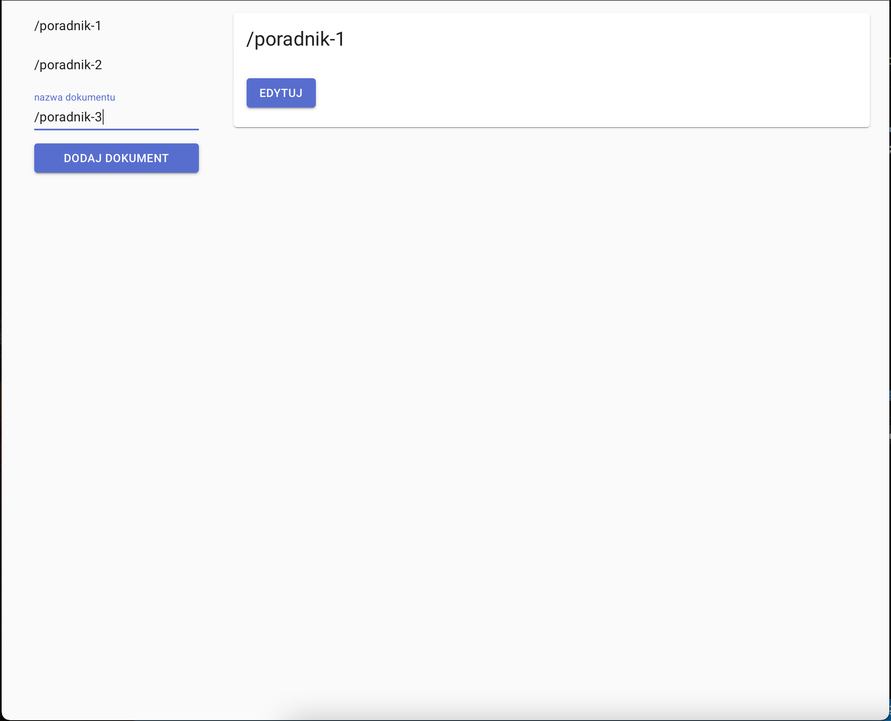
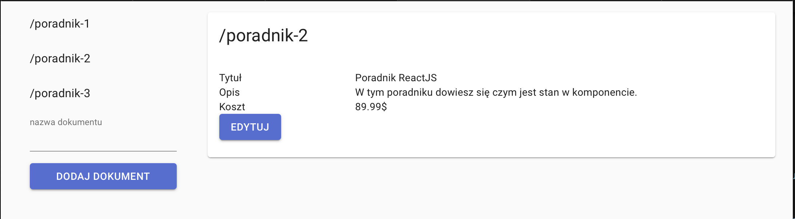
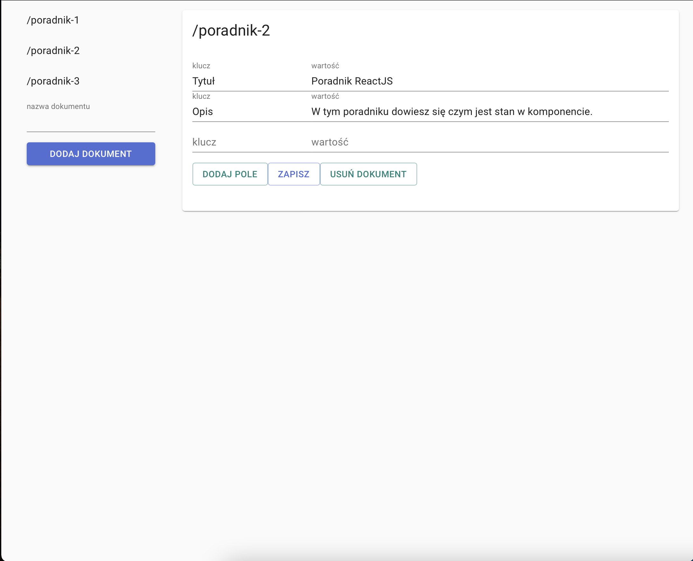
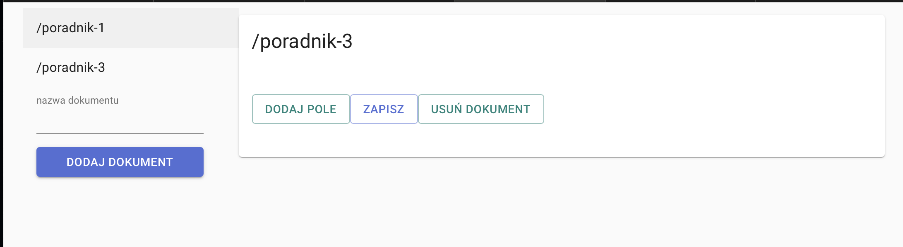

# Aplikacje Internetowe - 185IC B2 21709 - aplikacja typu CRUD

## sprawozdanie
Aplikacja korzysta z api, które przygotowałem na lab 4, zatem w tym repozytorium znajduje się jedynie frontend. Aby zobaczyć podpis należy najechać kursorem na zdjęcie.

